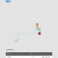

# Snake Game

A React/Redux-Saga snake game with deterministic simulation and pathfinding.
The default AI takes a safe shortest path to food and otherwise follows a long
path to its tail; it is fast but has no notion of the board state it is
steering into, so it can fall into loops and never converge. A separate
**+ Cycle Recovery** option runs the same greedy pathing but tracks food
progress and projected late-game risk; when either trips, it commits to a
bounded body-state recovery path before using safe cycle shortcuts for the
remainder of that game (this needs a board with at least one even dimension,
since it falls back to a Hamiltonian cycle). Two separate cycle-based options
support rectangular boards with at least one even dimension: **Hamiltonian
Cycle** strictly follows the cycle, while **Hamiltonian Cycle with Safe
Shortcuts** takes deterministic forward jumps toward food only when cycle
order and growth reserve remain safe. Both cycle strategies reach perfect
score within `boardArea * (boardArea - 1)` frames.

The main entry point is [SnakeGame.jsx](./SnakeGame.jsx).
